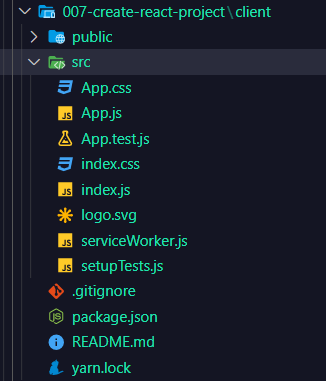
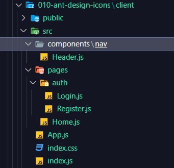

# 7. Create React Project

`npx create-react-app client`



`cd client`

`npm start`

```js
//App.js
import React from "react";

const App = () => (
  <div>
    <p>react app</p>
  </div>
);

export default App;
```

```js
//index.js
import React from "react";
import ReactDOM from "react-dom";
import "./index.css";
import App from "./App";
import * as serviceWorker from "./serviceWorker";

ReactDOM.render(
  <React.StrictMode>
    <App />
  </React.StrictMode>,
  document.getElementById("root")
);

// If you want your app to work offline and load faster, you can change
// unregister() to register() below. Note this comes with some pitfalls.
// Learn more about service workers: https://bit.ly/CRA-PWA
serviceWorker.unregister();
```

# 8. Routes and Pages

`npm i react-router-dom`


```js
//Login.js
import React from "react";

const Login = () => {
  return (
    <div>
      <p>Login</p>
    </div>
  );
};

export default Login;
```

```js
//Register.js
import React from "react";

const Register = () => {
  return (
    <div>
      <p>Register</p>
    </div>
  );
};

export default Register;
```

```js
//Home.js
import React from "react";

const Home = () => (
  <div>
    <p>react home</p>
  </div>
);

export default Home;
```

```js
//App.js
import React from "react";
import { Switch, Route } from "react-router-dom"; //*
import Login from "./pages/auth/Login";
import Register from "./pages/auth/Register";
import Home from "./pages/Home";

const App = () => {
  return (
    <Switch>
      <Route exact path="/" component={Home} />
      <Route exact path="/login" component={Login} />
      <Route exact path="/register" component={Register} />
    </Switch>
  );
};

export default App;
```

```js
//index.js
import React from "react";
import ReactDOM from "react-dom";
import "./index.css";
import App from "./App";
import * as serviceWorker from "./serviceWorker";
import { BrowserRouter } from "react-router-dom"; //*

ReactDOM.render(
  <React.StrictMode>
    <BrowserRouter>
      <App />
    </BrowserRouter>
  </React.StrictMode>,
  document.getElementById("root")
);

// If you want your app to work offline and load faster, you can change
// unregister() to register() below. Note this comes with some pitfalls.
// Learn more about service workers: https://bit.ly/CRA-PWA
serviceWorker.unregister();
```

# 9. Ant Design Navigation

_Bootstrap Material:_

**[mdbootstrap.com/installation/](https://mdbootstrap.com/docs/standard/getting-started/installation/)**

```html
<link
  rel="stylesheet"
  href="https://unpkg.com/bootstrap-material-design@4.1.1/dist/css/bootstrap-material-design.min.css"
  integrity="sha384-wXznGJNEXNG1NFsbm0ugrLFMQPWswR3lds2VeinahP8N0zJw9VWSopbjv2x7WCvX"
  crossorigin="anonymous"
/>
```

**[ant.design/components/](https://ant.design/components/menu/#header)**

`npm i antd`

`npm i @ant-design/icons`

# 10. Ant Design Icons



```js
// Header.js
import React, { useState } from "react";
import { Menu } from "antd";
import { AppstoreOutlined, SettingOutlined, UserOutlined, UserAddOutlined } from "@ant-design/icons"; //antd-icon

const { SubMenu, Item } = Menu;

const Header = () => {
  const [current, setCurrent] = useState("home");

  const handleClick = (e) => {
    // console.log(e.key);
    setCurrent(e.key);
  };

  return (
    <Menu onClick={handleClick} selectedKeys={[current]} mode="horizontal">
      <Item key="home" icon={<AppstoreOutlined />}>
        Home
      </Item>
      <Item key="register" icon={<UserAddOutlined />} className="float-right">
        Register
      </Item>
      <Item key="login" icon={<UserOutlined />} className="float-right">
        Login
      </Item>
      <SubMenu icon={<SettingOutlined />} title="Username">
        <Item key="setting:1">Option 1</Item>
        <Item key="setting:2">Option 2</Item>
      </SubMenu>
    </Menu>
  );
};

export default Header;
```

```js
// App.js
import React from "react";
import { Switch, Route } from "react-router-dom";
import Login from "./pages/auth/Login";
import Register from "./pages/auth/Register";
import Home from "./pages/Home";
import Header from "./components/nav/Header";

const App = () => {
  return (
    // *
    <>
      <Header />
      <Switch>
        <Route exact path="/" component={Home} />
        <Route exact path="/login" component={Login} />
        <Route exact path="/register" component={Register} />
      </Switch>
    </>
  );
};

export default App;
```

```js
// index.js
import React from "react";
import ReactDOM from "react-dom";
import "./index.css";
import App from "./App";
import * as serviceWorker from "./serviceWorker";
import { BrowserRouter } from "react-router-dom";
import "antd/dist/antd.css";

ReactDOM.render(
  // <React.StrictMode>
  <BrowserRouter>
    <App />
  </BrowserRouter>,
  // </React.StrictMode>,
  document.getElementById("root")
);

// If you want your app to work offline and load faster, you can change
// unregister() to register() below. Note this comes with some pitfalls.
// Learn more about service workers: https://bit.ly/CRA-PWA
serviceWorker.unregister();
```

# 11. React Router Link

```js
//Header.js
import React, { useState } from "react";
import { Menu } from "antd";
import { AppstoreOutlined, SettingOutlined, UserOutlined, UserAddOutlined } from "@ant-design/icons";
import { Link } from "react-router-dom";

const { SubMenu, Item } = Menu;

const Header = () => {
  const [current, setCurrent] = useState("home");

  const handleClick = (e) => {
    // console.log(e.key);
    setCurrent(e.key);
  };

  return (
    <Menu onClick={handleClick} selectedKeys={[current]} mode="horizontal">
      <Item key="home" icon={<AppstoreOutlined />}>
        <Link to="/">Home</Link>
      </Item>

      <Item key="register" icon={<UserAddOutlined />} className="float-right">
        <Link to="/register">Register</Link>
      </Item>

      <Item key="login" icon={<UserOutlined />} className="float-right">
        <Link to="/login">Login</Link>
      </Item>

      <SubMenu icon={<SettingOutlined />} title="Username">
        <Item key="setting:1">Option 1</Item>
        <Item key="setting:2">Option 2</Item>
      </SubMenu>
    </Menu>
  );
};

export default Header;
```
